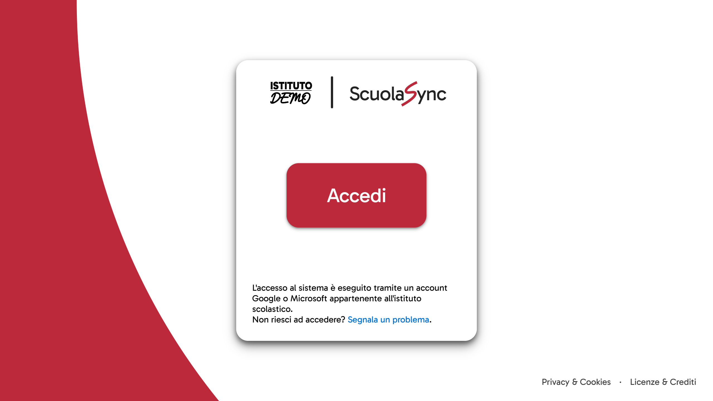
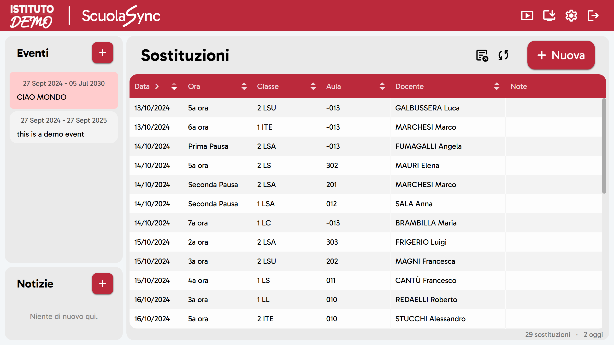
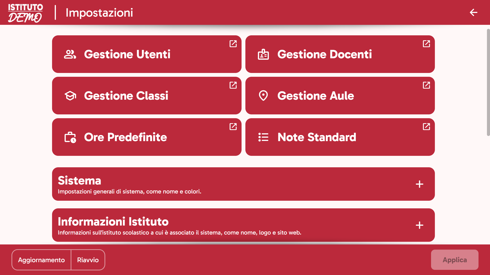
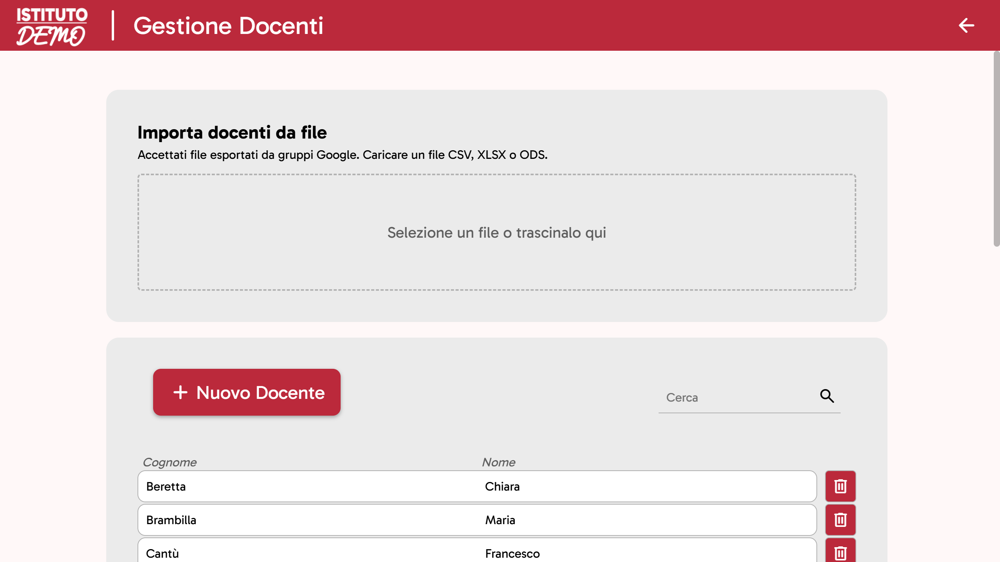

  

 

  Sistema per la gestione di sostituzioni, eventi e notizie scolastiche.

 

> Prova la **[Demo](https://scuolasync.fuss.bz.it)** per vedere il sistema in azione.

## [Documentazione](https://nkoexe.github.io/scuolasync)

- [Installazione](https://nkoexe.github.io/scuolasync/#/installazione/README)
- [FAQ](https://nkoexe.github.io/scuolasync/#/faq)

## Screenshot

## License

Copyright (C) 2023-present Niccolò Ragazzi <[hi@njco.dev](mailto:hi@njco.dev)>

ScuolaSync is licensed under a **dual license** model.

### 1. Source code

The program's source code is available under the **GNU Affero General Public License version 3**.

See the full text of the GNU AGPLv3 in the [LICENSE](LICENSE) file.

### 2. Documentation, User Interface, Graphic Assets

The program's documentation, user interface design and graphic assets and other images are licensed under **[Creative Commons Attribution-NonCommercial-ShareAlike 4.0 International](https://creativecommons.org/licenses/by-nc-sa/4.0/)**.

This applies to the files contained in the following directories:

- /docs
- sostituzioni/view/static/icons
- sostituzioni/view/static/images
- sostituzioni/view/static/screenshots

### 3. Third-party Licenses

ScuolaSync uses third-party libraries that are licensed under different terms. These third-party libraries are not covered by ScuolaSync's AGPLv3 or CC BY-NC-SA 4.0 licenses, and their respective licenses apply.

Some of these libraries have specific restrictions, particularly:

- **[fuzzyset.js](http://github.com/Glench/fuzzyset.js)**\
  This library is licensed under the Prosperity Public License 3.0, which **restricts use to non-commercial purposes only**. If you wish to use fuzzyset.js in a commercial setting, you must obtain a separate commercial license from the library's author.

See the [THIRD_PARTY_LICENSES](THIRD_PARTY_LICENSES) file for a full list of third-party libraries and their licenses.
